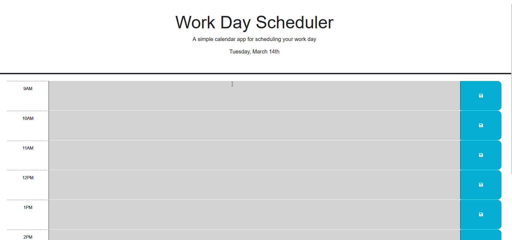

This project is complete.

When the save button is clicked, the value of the textinput is saved to local storage, and redisplayed on refresh.

It uses dayjs to find the time, and display it on the page as well as highlight the current hour in red, with future hours in green and past hours in gray. When the work day is over (after 5 pm, which are normal business hours according to law.cornell.edu), all time slots are displayed in gray until 9am the following day.

Link to deployed github page: https://laurenwollaston.github.io/Work-Day-Scheduler/
